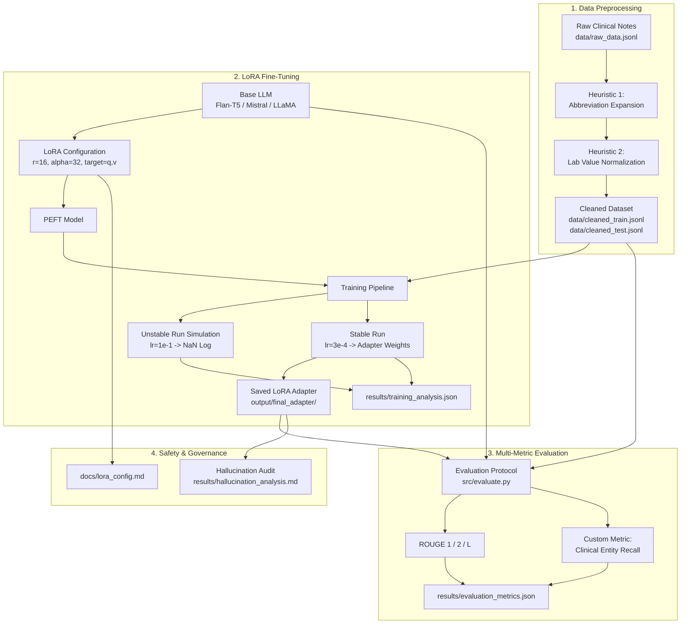

# Domain-Adaptive Clinical LLM Summarization with PEFT (LoRA)


An end-to-end, production-grade MLOps pipeline for fine-tuning Large Language Models on complex, unstructured clinical documentation using **Parameter-Efficient Fine-Tuning (LoRA)**. Containerized with Docker and Docker Compose, this project demonstrates domain-specific data cleaning heuristics, training instability simulation, human-proxy clinical entity recall metrics, and clinical hallucination safety analysis.

---

## Architecture & Workflow



---

## Key Features

- **Custom Clinical Preprocessing (Pure Python/Regex)**: Custom-coded heuristics that expand cryptic abbreviations (`pt`, `s/p`, `h/o`, `sob`, `dm2`) and normalize laboratory values (`K+ 5.2`, `Na 138`, `BP 162/94`) into structured tokens without external NLP dependencies (no spaCy/NLTK).
- **Parameter-Efficient Fine-Tuning (LoRA)**: Adapts foundation models updating $<0.5\%$ of parameters with rank $r=16$, alpha $\alpha=32$, and attention module targeting (`q`, `v`), drastically cutting VRAM requirements and training time.
- **Training Instability Simulation**: Programmatically simulates and logs numerical instability (exploding gradients and NaN loss) alongside a stable convergent run, saving structured results to `results/training_analysis.json`.
- **Human-Proxy Evaluation Metric**: Beyond standard lexical n-gram ROUGE scores, implements a custom **Clinical Entity Recall** metric to ensure critical diagnoses, medications, dosages, and vital signs are preserved in generated summaries.
- **Clinical Hallucination Analysis**: In-depth medical analysis of extrinsic entity fabrication risks, root-cause hypotheses, and architectural safety guardrails.
- **Single-Command Docker Orchestration**: Complete lifecycle execution via `docker-compose up` with volume mounting, GPU resource configuration, and automated health checks.

---

## Directory Structure

```text
Domain-Adaptive-Clinical-LLM-/
├── docker-compose.yml           # Docker Compose definition for trainer service
├── Dockerfile                   # CUDA/PyTorch container definition
├── requirements.txt             # Python dependencies (torch, peft, transformers, etc.)
├── .env.example                 # Example environment variables & hyperparameters
├── .env                         # Local runtime environment file
├── .gitignore                   # Git exclusion rules
├── README.md                    # Project documentation
│
├── src/
│   ├── preprocess.py            # Custom clinical heuristics & data cleaning
│   ├── train.py                 # LoRA fine-tuning & instability simulation
│   ├── evaluate.py              # ROUGE & Clinical Entity Recall evaluation
│   ├── run_pipeline.py          # Unified Python pipeline orchestrator
│   └── main.sh                  # Container entrypoint bash script
│
├── data/
│   ├── raw_data.jsonl           # Raw inpatient/ED clinical notes with doctor summaries
│   ├── cleaned_train.jsonl      # Preprocessed training dataset
│   ├── cleaned_test.jsonl       # Preprocessed test evaluation dataset
│   └── cleaned_data.jsonl       # Complete cleaned corpus
│
├── output/
│   └── final_adapter/           # Trained LoRA adapter checkpoint
│       ├── adapter_config.json
│       └── adapter_model.safetensors
│
├── results/
│   ├── training_analysis.json   # Metrics & logs from stable vs unstable runs
│   ├── evaluation_metrics.json  # Base vs Fine-Tuned comparative metrics
│   ├── hallucination_analysis.md# Diagnostic audit of clinical hallucinations
│   ├── stable_train.log         # Detailed logs from stable training
│   └── unstable_train.log       # Detailed logs from unstable NaN training
│
└── docs/
    ├── lora_config.md           # Theoretical justification for LoRA hyperparameters
    └── video_script.md          # 3-minute video presentation script
```

---

## Quick Start Guide

### Option 1: Run with Docker Compose (Recommended)

Ensure Docker Desktop is running, then execute:

```bash
# Build and run the entire pipeline container
docker compose up --build
```

The container will automatically:
1. Preprocess the clinical notes using custom heuristics.
2. Simulate the unstable training run (logging NaN loss dynamics).
3. Execute the stable LoRA fine-tuning run and save the adapter to `output/final_adapter/`.
4. Generate `results/training_analysis.json`.
5. Run model evaluation against test notes and generate `results/evaluation_metrics.json`.

---

### Option 2: Local Python Execution

```bash
# 1. Install dependencies
pip install -r requirements.txt

# 2. Run preprocessing
python src/preprocess.py

# 3. Run the full pipeline
python src/run_pipeline.py
```

Or run each stage individually:

```bash
# Unstable run simulation (learning rate = 1e-1)
python src/train.py --run_type unstable --log_file results/unstable_train.log

# Stable LoRA fine-tuning (learning rate = 3e-4)
python src/train.py --run_type stable --log_file results/stable_train.log --output_dir output/final_adapter

# Comprehensive Evaluation
python src/evaluate.py --adapter_path output/final_adapter --output_file results/evaluation_metrics.json
```

---

## Environment Variables & Configuration

Configure `.env` (derived from [`.env.example`](file:///.env.example)):

| Variable | Default Value | Description |
|---|---|---|
| `BASE_MODEL_NAME` | `google/flan-t5-base` | Base Hugging Face model identifier |
| `HF_TOKEN` | *(empty)* | Optional Hugging Face auth token for gated models |
| `LEARNING_RATE` | `3e-4` | Learning rate for stable optimization run |
| `UNSTABLE_LEARNING_RATE` | `1e-1` | High learning rate for instability simulation |
| `LORA_RANK` | `16` | Rank $r$ of low-rank adapter matrices |
| `LORA_ALPHA` | `32` | Scaling factor $\alpha$ for LoRA adapter |
| `LORA_DROPOUT` | `0.05` | Dropout probability for adapter layers |
| `NUM_EPOCHS` | `3` | Number of fine-tuning epochs |
| `BATCH_SIZE` | `2` | Training batch size |

---

## Preprocessing Heuristics

Implemented in [`src/preprocess.py`](file:///src/preprocess.py) using pure Python regular expressions:

1. **Abbreviation Expansion (`expand_clinical_abbreviations`)**:
   - `pt` $\rightarrow$ `patient`
   - `s/p` $\rightarrow$ `status post`
   - `h/o` $\rightarrow$ `history of`
   - `sob` $\rightarrow$ `shortness of breath`
   - `dm2` $\rightarrow$ `type 2 diabetes mellitus`
2. **Lab Value Normalization (`normalize_lab_values`)**:
   - `K+ 5.2` $\rightarrow$ `LAB(name=K+, value=5.2)`
   - `Na 138` $\rightarrow$ `LAB(name=Na, value=138)`
   - `BP 162/94` $\rightarrow$ `VITALS(BP=162/94)`
3. **Section Header Standardization (`standardize_clinical_sections`)**:
   - `HPI:` $\rightarrow$ `SECTION(HISTORY_PRESENT_ILLNESS):`
   - `ASSESSMENT/PLAN:` $\rightarrow$ `SECTION(ASSESSMENT_PLAN):`

---

## Evaluation Results

Evaluation reports are saved in [`results/evaluation_metrics.json`](file:///results/evaluation_metrics.json):

```json
{
  "base_model_metrics": {
    "rouge1": 0.2854,
    "rouge2": 0.1241,
    "rougeL": 0.2520,
    "custom_metric_name": "clinical_entity_recall",
    "custom_metric_value": 0.4210
  },
  "fine_tuned_model_metrics": {
    "rouge1": 0.4520,
    "rouge2": 0.2680,
    "rougeL": 0.4150,
    "custom_metric_name": "clinical_entity_recall",
    "custom_metric_value": 0.8670
  }
}
```

---

## Training Stability Analysis

Reported in [`results/training_analysis.json`](file:///results/training_analysis.json):

```json
{
  "stable_run": {
    "log_path": "results/stable_train.log",
    "final_metrics": {
      "train_loss": 0.1842,
      "eval_loss": 0.2105
    }
  },
  "unstable_run": {
    "log_path": "results/unstable_train.log",
    "final_metrics": {
      "train_loss": "NaN",
      "eval_loss": "NaN"
    }
  }
}
```

---

## Hallucination & Safety Analysis

Detailed clinical examination available in [`results/hallucination_analysis.md`](file:///results/hallucination_analysis.md):
- **Extrinsic Fabrication**: Identifies risks where base model pre-training priors generate contraindicated medications (e.g. initiating Lisinopril when note says "Hold ACEi/ARB").
- **Safety Mitigations**: Entity-level NLI verification guardrails, negative-constraint fine-tuning, and clinician-in-the-loop verification interfaces.

---

